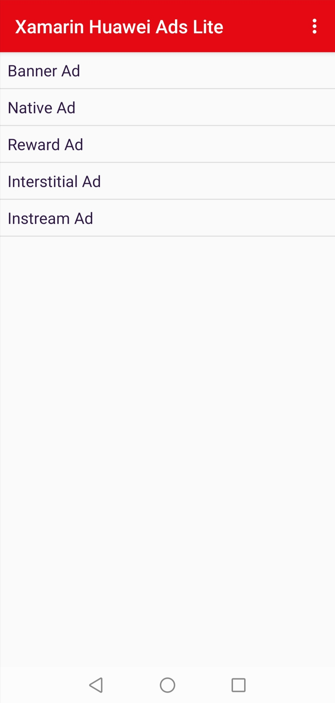

  <h1 align="center">Huawei Ads Lite Xamarin Plugin - Demo</h1>

This demo projects are an example to demonstrate the features of the Ads Lite Xamarin Plugin.

[> Learn More](https://developer.huawei.com/consumer/en/doc/development/HMS-Plugin-Guides/service-introduction-0000001050178531)

## Installation

In the Solution Explorer panel, right click on the solution name and select Manage NuGet Packages. Search for [Huawei.Hms.AdsLite](https://www.nuget.org/packages/Huawei.Hms.AdsLite) and install the package into your Xamarin.Android projects.

## Documentation

You can follow below links to learn how to set up your environment and project before using HMS Ads Kit Xamarin Android Plugin in your application.

- [Quick Start](https://developer.huawei.com/consumer/en/doc/development/HMS-Plugin-Guides/preparing-development-environement-0000001050418813)
- [Configuring App Information in AppGallery Connect](https://developer.huawei.com/consumer/en/doc/development/HMS-Plugin-Guides/publisher-config-agc-0000001051056357) 
- [Configuring Network Permissions](https://developer.huawei.com/consumer/en/doc/development/HMS-Plugin-Guides/configuring-network-0000001072477465) 

### Additional Topics

- [Banner Ads](https://developer.huawei.com/consumer/en/doc/development/HMS-Plugin-Guides/xamarin-banner-ads-0000001050418457)
- [Advanced Settings](https://developer.huawei.com/consumer/en/doc/development/HMS-Plugin-Guides/xamarin-advanced-settings-0000001050267262)
- [API Reference](https://developer.huawei.com/consumer/en/doc/development/HMS-Plugin-References-V1/xamarin-apis-overview-0000001050285576-V1)

## Supported Environments
 
- Android 4.4 KitKat (API level 19) and later versions

- Compile using Visual Studio and Xamarin Android SDK 10.3.1.4 or later

## Questions or Issues

If you have questions about how to use HMS samples, try the following options:
- [Stack Overflow](https://stackoverflow.com/questions/tagged/huawei-mobile-services) is the best place for any programming questions. Be sure to tag your question with 
**huawei-mobile-services**.
- [Huawei Developer Forum](https://forums.developer.huawei.com/forumPortal/en/home?fid=0101187876626530001) HMS Core Module is great for general questions, or seeking recommendations and opinions.
- [Huawei Developer Docs](https://developer.huawei.com/consumer/en/doc/overview/HMS-Core-Plugin) is place to official documentation for all HMS Core Kits, you can find detailed documentations in there.

## License

HMS Ads Kit Xamarin Android Plugin - Demo is licensed under [Apache 2.0 license](LICENSE)