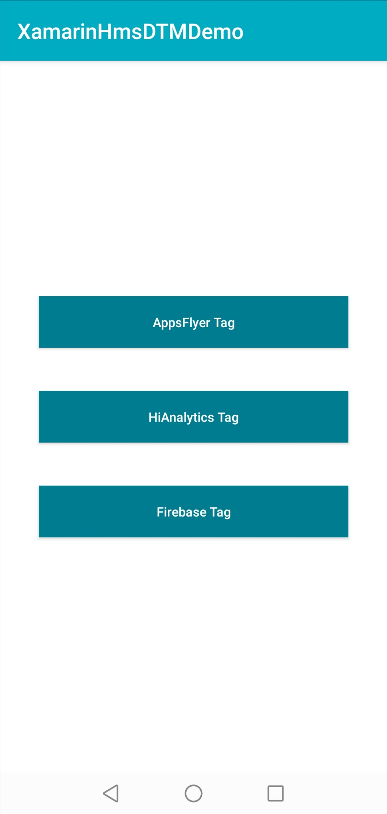

  <h1 align="center">HMS Dynamic Tag Manager Kit Xamarin Android Plugin - Demo</h1>

This demo project is an example to demonstrate the features of the HMS Dynamic Tag Manager Kit Xamarin Android Plugin.

[> Learn More](https://developer.huawei.com/consumer/en/doc/development/HMS-Plugin-Guides/introduction-0000001077902368)

## Installation

In the Solution Explorer panel, right click on the solution name and select Manage NuGet Packages. Search for [Huawei.Hms.DtmApi](https://www.nuget.org/packages/Huawei.Hms.DtmApi) and install the package into your Xamarin.Android projects.

## Documentation

You can follow below links to learn how to set up your environment and project before using HMS Dynamic Tag Manager Kit Xamarin Android Plugin in your application.

- [Quick Start](https://developer.huawei.com/consumer/en/doc/development/HMS-Plugin-Guides-V1/preparing-dev-environment-0000001057115095-V1)
- [Integrating the HMS Core SDK](https://developer.huawei.com/consumer/en/doc/development/HMS-Plugin-Guides-V1/integrating-sdk-0000001057635106) 
- [Setting Package Information in Xamarin](https://developer.huawei.com/consumer/en/doc/development/HMS-Plugin-Guides-V1/setting-package-0000001057356930)

### Additional Topics

- [Operations on the Server](https://developer.huawei.com/consumer/en/doc/development/HMS-Plugin-Guides-V1/operations-server-0000001057546675-V1)
- [Reference](https://developer.huawei.com/consumer/en/doc/development/HMS-Plugin-References-V1/overview-0000001057667873-V1)

## Supported Environments
 
- Android 4.4 KitKat (API level 19) and later versions.

## Questions or Issues

If you have questions about how to use HMS samples, try the following options:
- [Stack Overflow](https://stackoverflow.com/questions/tagged/huawei-mobile-services) is the best place for any programming questions. Be sure to tag your question with 
**huawei-mobile-services**.
- [Huawei Developer Forum](https://forums.developer.huawei.com/forumPortal/en/home?fid=0101187876626530001) HMS Core Module is great for general questions, or seeking recommendations and opinions.
- [Huawei Developer Docs](https://developer.huawei.com/consumer/en/doc/overview/HMS-Core-Plugin) is place to official documentation for all HMS Core Kits, you can find detailed documentations in there.

## License

HMS Dynamic Tag Manager Kit Xamarin Android Plugin - Demo is licensed under [Apache 2.0 license](LICENCE)