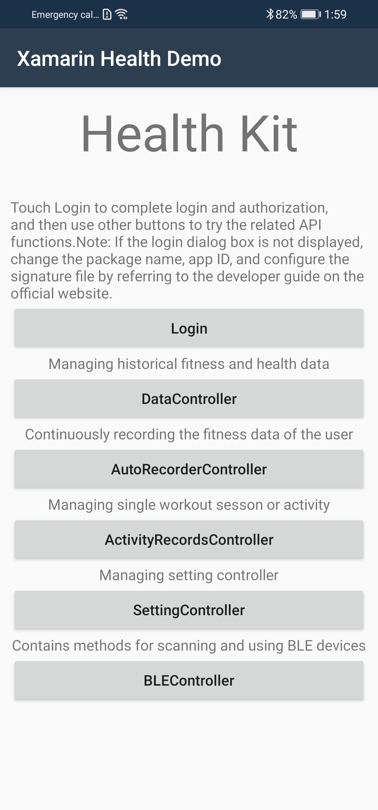
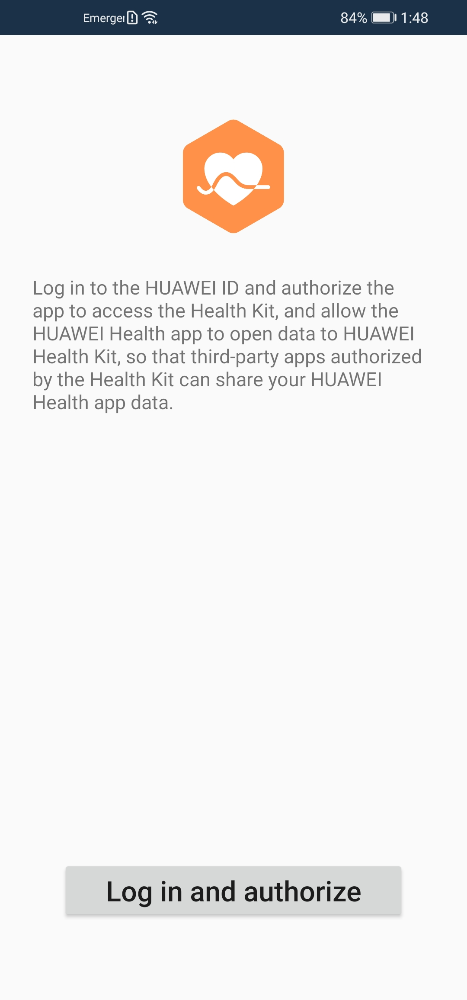
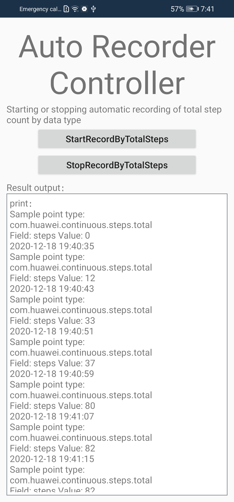
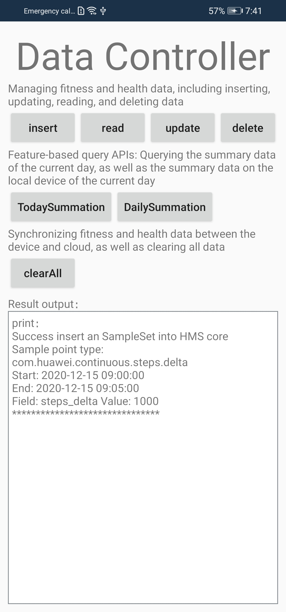
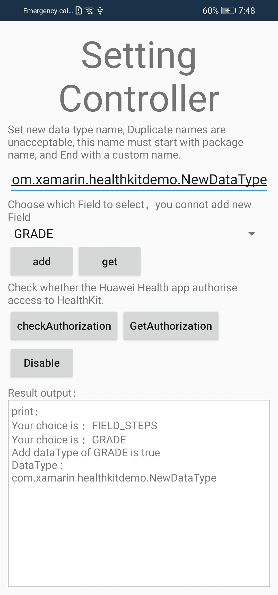
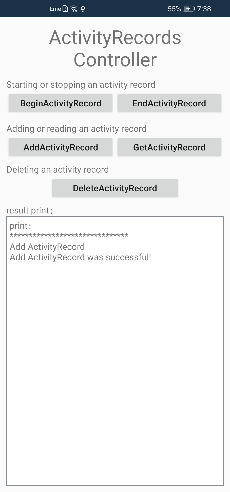
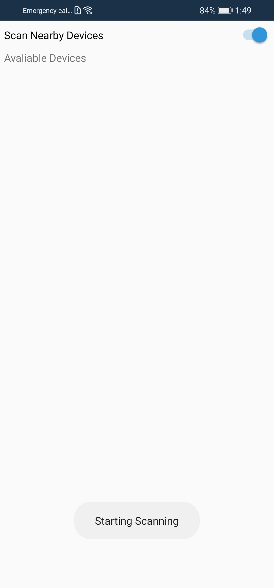

  <h1 align="center">HMS Health Kit Xamarin Android Plugin - Demo</h1>

HUAWEI Health Kit  allows ecosystem apps to access fitness and health data of users based on their HUAWEI ID and authorization. For consumers, Health Kit provides a mechanism for fitness and health data storage and sharing based on flexible authorization. For developers and partners, Health Kit provides a data platform and fitness and health open capabilities, so that they can build related apps and services based on a multitude of data types. Health Kit connects the hardware devices and ecosystem apps to provide consumers with health care, workout guidance, and ultimate service experience.

[> Learn More](https://developer.huawei.com/consumer/en/doc/development/HMS-Plugin-Guides/health-introduce-0000001073349887)

This project contains a demo app to demonstrate the features of the Health Kit Xamarin Plugin. The features are:

1. **Login and Authorization**

   Shows how to login using Huawei ID and enable the authorization.

2. **Manage health and sport data**

   Apply add/delete/update/query operations on health and sport data.

3. **Auto-record health data**

   This function can enable and disable the automatic recording feature of health data.

4. **Manage Activity Records**

   This function can create and manage sport activities.

5. **Operate DataType and Records**

   This function can add/read DataType and cancel All Records.

6. **Operate BLE devices**

   Enables scanning, discovering and saving BLE devices.

 
 
 
   

  
 
 

## Installation

In the Solution Explorer panel, right click on the solution name and select Manage NuGet Packages. Search for [Huawei.Hms.Health](https://www.nuget.org/packages/Huawei.Hms.Health) and install the package into your Xamarin.Android projects.

## Documentation

You can follow below links to learn how to set up your environment and project before using HMS Health Kit Xamarin Android Plugin in your application.

- [Quick Start](https://developer.huawei.com/consumer/en/doc/development/HMS-Plugin-Guides/preparedevenv-0000001073721939)
- [Integrating the HMS Core SDK](https://developer.huawei.com/consumer/en/doc/development/HMS-Plugin-Guides/integrate-plugin-0000001073619639) 
- [Setting Package Information in Xamarin](https://developer.huawei.com/consumer/en/doc/development/HMS-Plugin-Guides/setting-package-0000001073819800) 

### Additional Topics

- [Applying For Health Kit](https://developer.huawei.com/consumer/en/doc/development/HMS-Plugin-Guides/config-agc-0000001074109946#EN-US_TOPIC_0000001074109946__section163451318568)

- [Reference](https://developer.huawei.com/consumer/en/doc/development/HMS-Plugin-References-V1/overview-0000001072603831-V1)

## Supported Environments

- Android 8.1 (API level 27) and later versions

- Compile using Visual Studio and Xamarin Android SDK 10.3.1.4 or later

## Questions or Issues

If you have questions about how to use HMS samples, try the following options:
- [Stack Overflow](https://stackoverflow.com/questions/tagged/huawei-mobile-services) is the best place for any programming questions. Be sure to tag your question with 
**huawei-mobile-services**.
- [Huawei Developer Forum](https://forums.developer.huawei.com/forumPortal/en/home?fid=0101187876626530001) HMS Core Module is great for general questions, or seeking recommendations and opinions.
- [Huawei Developer Docs](https://developer.huawei.com/consumer/en/doc/overview/HMS-Core-Plugin) is place to official documentation for all HMS Core Kits, you can find detailed documentations in there. 

## License

HMS Health Kit Xamarin Android Plugin - Demo is licensed under [Apache 2.0 license](LICENCE)