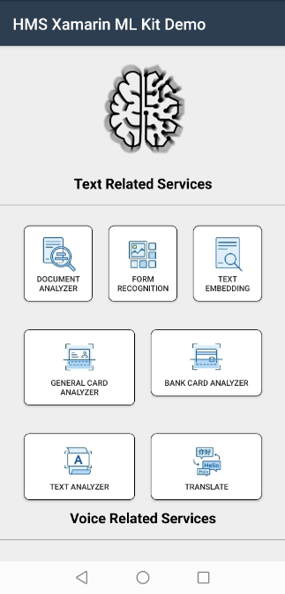

  <h1 align="center">HMS ML Kit Xamarin Android Plugin - Demo</h1>

This demo project is an example to demonstrate the features of the HMS ML Kit Xamarin Android Plugin.

[> Learn More](https://developer.huawei.com/consumer/en/doc/development/HMS-Plugin-Guides-V1/about-service-0000001052602130-V1)

## Installation

In the Solution Explorer panel, right click on the solution name and select Manage NuGet Packages. Search for following packages and install the packages into your Xamarin.Android projects.

### ML Kit Base Library

| Library Name  | Nuget |
|--------|-----|
| Huawei.Hms.MlComputerVisionCloud   |   |

### Text services

#### Text Recognition

| Library Name  | Nuget |
|--------|-----|
| Huawei.Hms.MlComputerVisionOcr   |   |
| Huawei.Hms.MlComputerVisionOcrBase  |   |
| Huawei.Hms.MlComputerVisionOcrCnModel   |   |
| Huawei.Hms.MlComputerVisionOcrJkModel   |   |
| Huawei.Hms.MlComputerVisionOcrLatinModel   |   |

#### Bank Card Recognition

| Library Name  | Nuget |
|--------|-----|
| Huawei.Hms.MlComputerCardBcr  |   |
| Huawei.Hms.MlComputerCardBcrInner  |   |
| Huawei.Hms.MlComputerCardBcrNodynamicModel   |   |
| Huawei.Hms.MlComputerCardBcrNodynamicSdk  |   |

#### General Card Recognition

| Library Name  | Nuget |
|--------|-----|
| Huawei.Hms.MlComputerCardGcrPlugin  |   |
| Huawei.Hms.MlComputerCardQaPlugin  |   |

#### Form Recognition

| Library Name  | Nuget |
|--------|-----|
| Huawei.Hms.MlComputerVisionFormrecognition  |   |
| Huawei.Hms.MlComputerVisionFormrecognitionInner  |   |
| Huawei.Hms.MlComputerVisionFormrecognitionModel   |   |

### Language/Voice-related Services

#### Text Translation

| Library Name  | Nuget |
|--------|-----|
| Huawei.Hms.MlComputerTranslate  |   |
| Huawei.Hms.MlComputerTranslateModel  |   |

#### Language Detection

| Library Name  | Nuget |
|--------|-----|
| Huawei.Hms.MlComputerLanguageDetection   |   |
| Huawei.Hms.MlComputerLanguageDetectionModel   |   |
| Huawei.Hms.MlComputerLanguageInner   |   |

#### Automatic Speech Recognition

| Library Name  | Nuget |
|--------|-----|
| Huawei.Hms.MlComputerVoiceAsr  |   |
| Huawei.Hms.MlComputerVoiceAsrPlugin  |   |
| Huawei.Hms.MlComputerVoiceAsrSdk   |   |

#### Text to Speech

| Library Name  | Nuget |
|--------|-----|
| Huawei.Hms.MlComputerVoiceTts  |   |
| Huawei.Hms.MlComputerVoiceTtsInner  |   |
| Huawei.Hms.MlComputerVoiceTtsModelBee   |   |
| Huawei.Hms.MlComputerVoiceTtsModelEagle  |   |

#### Audio File Transcription

| Library Name  | Nuget |
|--------|-----|
| Huawei.Hms.MlComputerVoiceAft  |   |

#### Real-Time Transcription

| Library Name  | Nuget |
|--------|-----|
| Huawei.Hms.MlComputerVoiceRealtimetranscription  |   |

#### Sound Detection

| Library Name  | Nuget |
|--------|-----|
| Huawei.Hms.MlSpeechSemanticsSounddectSdk  |   |
| Huawei.Hms.MlSpeechSemanticsSounddectInner  |   |
| Huawei.Hms.MlSpeechSemanticsSounddectModel   |   |

### Image-related Services

#### Image Classification

| Library Name  | Nuget |
|--------|-----|
| Huawei.Hms.MlComputerVisionClassification  |   |
| Huawei.Hms.MlComputerVisionImageClassificationModel  |   |

#### Object Detection and Tracking

| Library Name  | Nuget |
|--------|-----|
| Huawei.Hms.MlComputerVisionObject  |   |
| Huawei.Hms.MlComputerVisionObjectDetectionModel  |   |

#### Image Segmentation

| Library Name  | Nuget |
|--------|-----|
| Huawei.Hms.MlComputerVisionSegmentation  |   |
| Huawei.Hms.MlComputerVisionImageSegmentationBase  |   |
| Huawei.Hms.MlComputerVisionImageSegmentationBodyModel  |   |
| Huawei.Hms.MlComputerVisionImageSegmentationMulticlassModel  |   |

#### Product Visual Search

| Library Name  | Nuget |
|--------|-----|
| Huawei.Hms.MlProductVisualSearchPlugin |   |

#### Image Super-Resolution

| Library Name  | Nuget |
|--------|-----|
|  Huawei.Hms.MlComputerVisionImagesuperresolution |   |
| Huawei.Hms.MlComputerVisionImagesuperresolutionInner |   |
| Huawei.Hms.MlComputerVisionImagesuperresolutionModel |   |

#### Document Skew Correction

| Library Name  | Nuget |
|--------|-----|
| Huawei.Hms.MlComputerVisionDocumentskew |   |
| Huawei.Hms.MlComputerVisionDocumentskewInner  |   |
| Huawei.Hms.MlComputerVisionDocumentskewModel  |   |

#### Text Image Super-Resolution

| Library Name  | Nuget |
|--------|-----|
| Huawei.Hms.MlComputerVisionTextimagesuperresolution |   |
| Huawei.Hms.MlComputerVisionTextimagesuperresolutionInner |   |
| Huawei.Hms.MlComputerVisionTextimagesuperresolutionModel  |   |

#### Scene Detection

| Library Name  | Nuget |
|--------|-----|
| Huawei.Hms.MlComputerVisionScenedetection |   |
| Huawei.Hms.MlComputerVisionScenedetectionInner |   |
| Huawei.Hms.MlComputerVisionScenedetectionModel  |   |

### Face/Body-related Services

#### Face Detection

| Library Name  | Nuget |
|--------|-----|
| Huawei.Hms.MlComputerVisionFace |   |
| Huawei.Hms.MlComputerVisionFaceBase  |   |
| Huawei.Hms.MlComputerVisionFace3dModel  |   |
| Huawei.Hms.MlComputerVisionFaceEmotionModel  |   |
| Huawei.Hms.MlComputerVisionFaceFeatureModel |   |
| Huawei.Hms.MlComputerVisionFaceShapePointModel |   |

#### Skeleton Detection

| Library Name  | Nuget |
|--------|-----|
| Huawei.Hms.MlComputerVisionSkeleton |   |
| Huawei.Hms.MlComputerVisionSkeletonBase |   |
| Huawei.Hms.MlComputerVisionSkeletonInner  |   |
| Huawei.Hms.MlComputerVisionSkeletonModel |   |
| Huawei.Hms.MlComputerVisionYogaModel |   |

#### Liveness Detection

| Library Name  | Nuget |
|--------|-----|
| Huawei.Hms.MlComputerVisionLivenessdetection |   |
| Huawei.Hms.MlComputerVisionLivenessdetectionInner |   |
| Huawei.Hms.MlComputerVisionLivenessdetectionNodynamicModel  |   |

#### Hand Keypoint Detection

| Library Name  | Nuget |
|--------|-----|
| Huawei.Hms.MlComputerVisionHandkeypoint |   |
| Huawei.Hms.MlComputerVisionHandkeypointInner |   |
| Huawei.Hms.MlComputerVisionHandkeypointModel  |   |

### Natural Language Processing Services

#### Text Embedding

| Library Name  | Nuget |
|--------|-----|
| Huawei.Hms.MlNlpTextembedding |   |

### Custom Model Services

#### Custom Model

| Library Name  | Nuget |
|--------|-----|
| Huawei.Hms.MlComputerModelExecutor |   |
| Huawei.Hms.MlComputerModelDownload |   |
| Huawei.Mindspore.MindsporeLite |   |

## Documentation

You can follow below links to learn how to set up your environment and project before using HMS ML Kit Xamarin Android Plugin in your application.

- [Quick Start](https://developer.huawei.com/consumer/en/doc/development/HMS-Plugin-Guides-V1/prepare-dev-env-0000001052968081-V1)
- [Integrating the HMS Core SDK](https://developer.huawei.com/consumer/en/doc/development/HMS-Plugin-Guides-V1/integrate-hms-core-0000001052248064-V1) 
- [Setting Package Information in Xamarin](https://developer.huawei.com/consumer/en/doc/development/HMS-Plugin-Guides-V1/setting-package-information-0000001074172648-V1)

### Additional Topics

- [Reference](https://developer.huawei.com/consumer/en/doc/development/HMS-Plugin-References-V1/overview-0000001052991421-V1)

## Supported Environments
 
- Android 4.4 KitKat (API level 19) and later versions

## Questions or Issues

If you have questions about how to use HMS samples, try the following options:
- [Stack Overflow](https://stackoverflow.com/questions/tagged/huawei-mobile-services) is the best place for any programming questions. Be sure to tag your question with 
**huawei-mobile-services**.
- [Huawei Developer Forum](https://forums.developer.huawei.com/forumPortal/en/home?fid=0101187876626530001) HMS Core Module is great for general questions, or seeking recommendations and opinions.
- [Huawei Developer Docs](https://developer.huawei.com/consumer/en/doc/overview/HMS-Core-Plugin) is place to official documentation for all HMS Core Kits, you can find detailed documentations in there.

## License

HMS ML Kit Xamarin Android Plugin - Demo is licensed under [Apache 2.0 license](LICENCE)