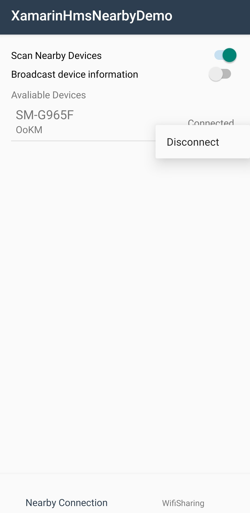
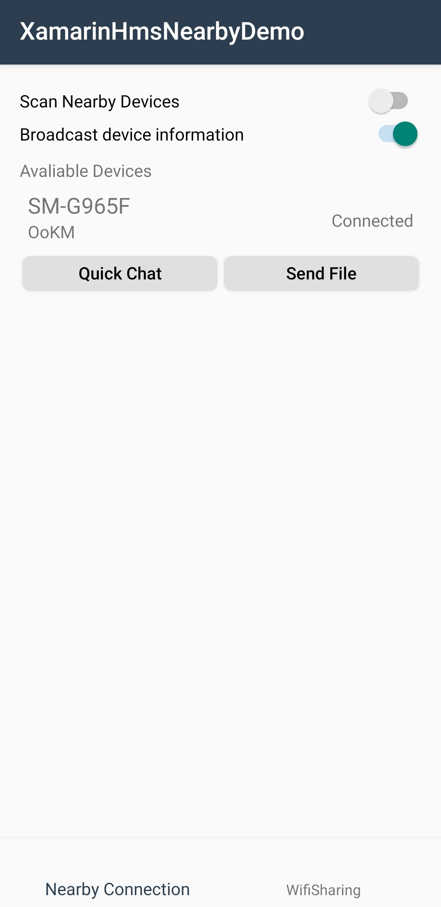
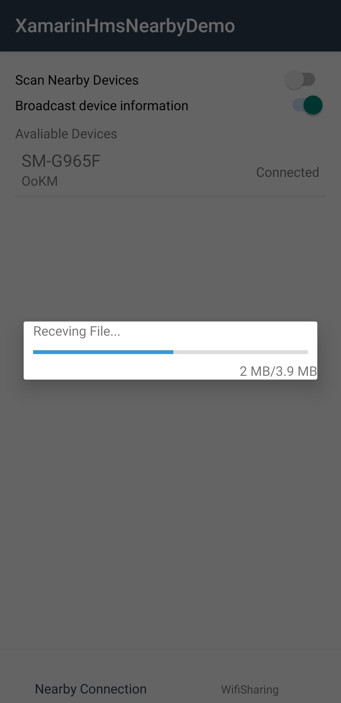
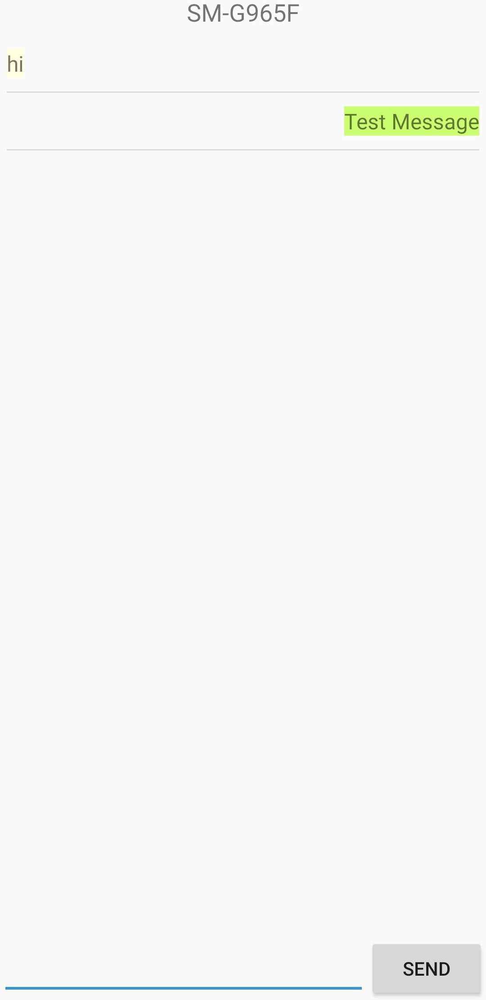
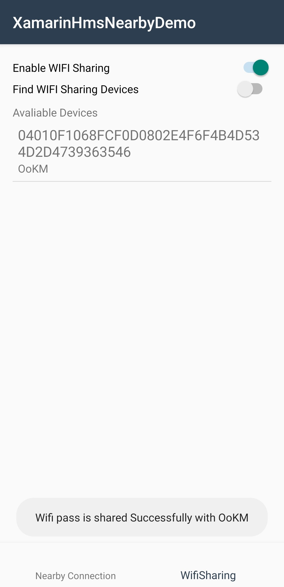
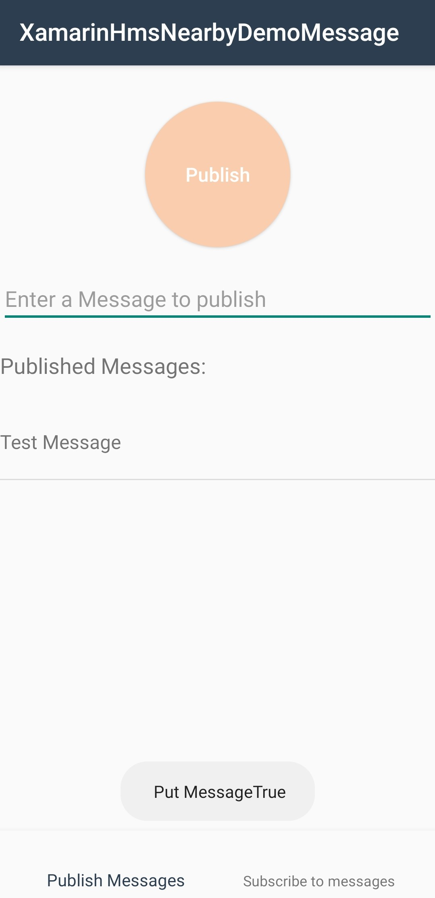
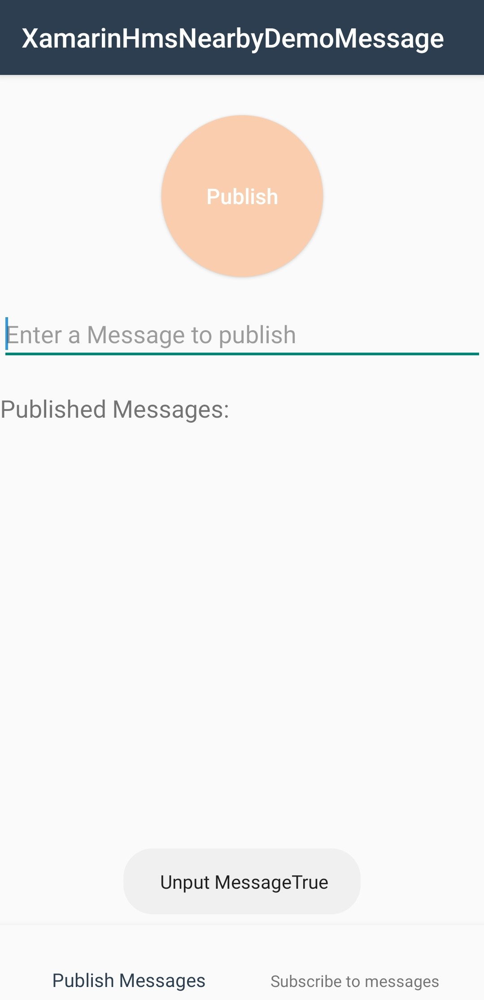
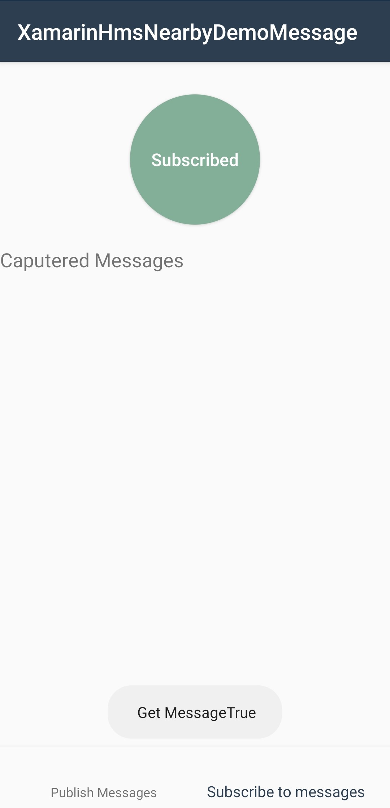
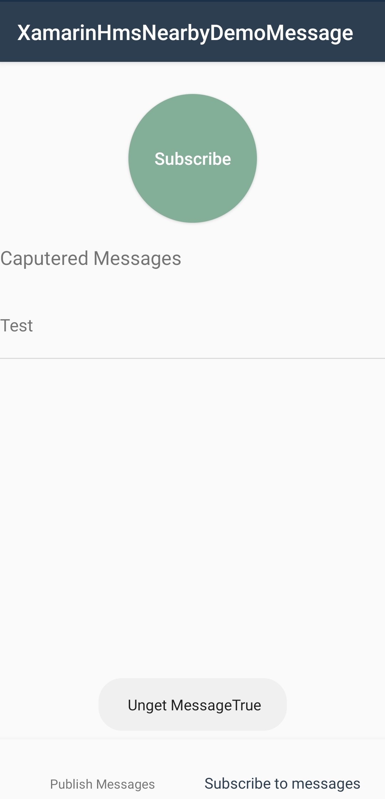

  <h1 align="center">HMS Nearby Service Xamarin Android Plugin - Demo</h1>

Data Communication allows apps to easily discover nearby devices and set up communication with them using technologies such as Bluetooth and Wi-Fi. The service provides Nearby Connection and Nearby Message APIs.

- Nearby Connection

  Discovers devices and sets up secure communication channels with them without connecting to the Internet and transfers byte arrays, files, and streams to them; supports seamless nearby interactions, such as multi-player gaming, real-time collaboration, resource broadcasting, and content sharing.

- Nearby Message

  Allows message publishing and subscription between nearby devices that are connected to the Internet. A subscriber (app) can obtain the message content from the cloud service based on the sharing code broadcast by a publisher (beacon or another app).

[> Learn More](https://developer.huawei.com/consumer/en/doc/development/HMS-Plugin-Guides/introduction-0000001062477568)

This project contains two demo apps to demonstrate the features of the Huawei Nearby Kit Xamarin Plugin.

**NearbyConnection**: This app demonstrates the usage of Discovery, Transfer and WIFI sharing features. The app contains two tabs:

- Nearby Connections Tab: there are two switches, Enable "Scan Nearby Devices" to discover the nearby devices. the available devices will appear in a list. "Broadcast device information " enables the device to to be discovered by other devices. to initiate a connection with another device click on one of the available devices in the list. after a connection is established  you can chat and exchange files as well.

- WIFI Sharing Tab: contains two switches, Enable "Enable WIFI Sharing" to discover other devices to share the current connected WIFI's password with. "Find WIFI Sharing Devices" enables the device to to be discovered by other devices. To share the current connected WIFI password with a device click on one of the devices in the available devices list.

 
 
       

  
      

**NearbyMessage**: The usage of Message feature can be found in this app. There are two tabs:

- Publish Messages: Enables publishing messages to other devices. write a message in the text box and click "Publish" to publish a message. To unpublish a message click and hold on one of the messages in the list and select "unpublish message".
- Subscribe to messages: Enables receiving published messages. click on "Subscribe" button to subscribe/unsubscribe to messages.

 
 

  
      

## Installation

In the Solution Explorer panel, right click on the solution name and select Manage NuGet Packages. Search for [Huawei.Hms.Nearby](https://www.nuget.org/packages/Huawei.Hms.Nearby) and install the package into your Xamarin.Android projects.

## Documentation

You can follow below links to learn how to set up your environment and project before using HMS Nearby Service Xamarin Android Plugin in your application.

- [Quick Start](https://developer.huawei.com/consumer/en/doc/development/HMS-Plugin-Guides/preparedevenv-0000001088299068)
- [Integrating the HMS Core SDK](https://developer.huawei.com/consumer/en/doc/development/HMS-Plugin-Guides/integrating-sdk-0000001088170580) 
- [Setting Package Information in Xamarin](https://developer.huawei.com/consumer/en/doc/development/HMS-Plugin-Guides/setting-package-0000001088619462) 

### Additional Topics

- [Reference](https://developer.huawei.com/consumer/en/doc/development/HMS-Plugin-References-V1/overview-0000001062363591-V1)

## Supported Environments

- Android 5.0 (API level 21) and later versions

- Compile using Visual Studio and Xamarin Android SDK 10.3.1.4 or later

## Questions or Issues

If you have questions about how to use HMS samples, try the following options:
- [Stack Overflow](https://stackoverflow.com/questions/tagged/huawei-mobile-services) is the best place for any programming questions. Be sure to tag your question with 
**huawei-mobile-services**.
- [Huawei Developer Forum](https://forums.developer.huawei.com/forumPortal/en/home?fid=0101187876626530001) HMS Core Module is great for general questions, or seeking recommendations and opinions.
- [Huawei Developer Docs](https://developer.huawei.com/consumer/en/doc/overview/HMS-Core-Plugin) is place to official documentation for all HMS Core Kits, you can find detailed documentations in there. 

## License

HMS Nearby Service Kit Xamarin Android Plugin - Demo is licensed under [Apache 2.0 license](LICENCE)